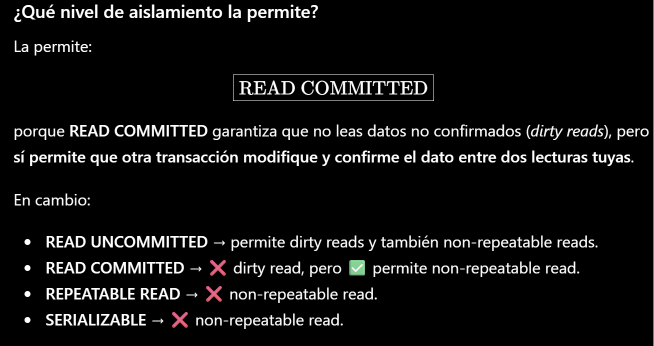
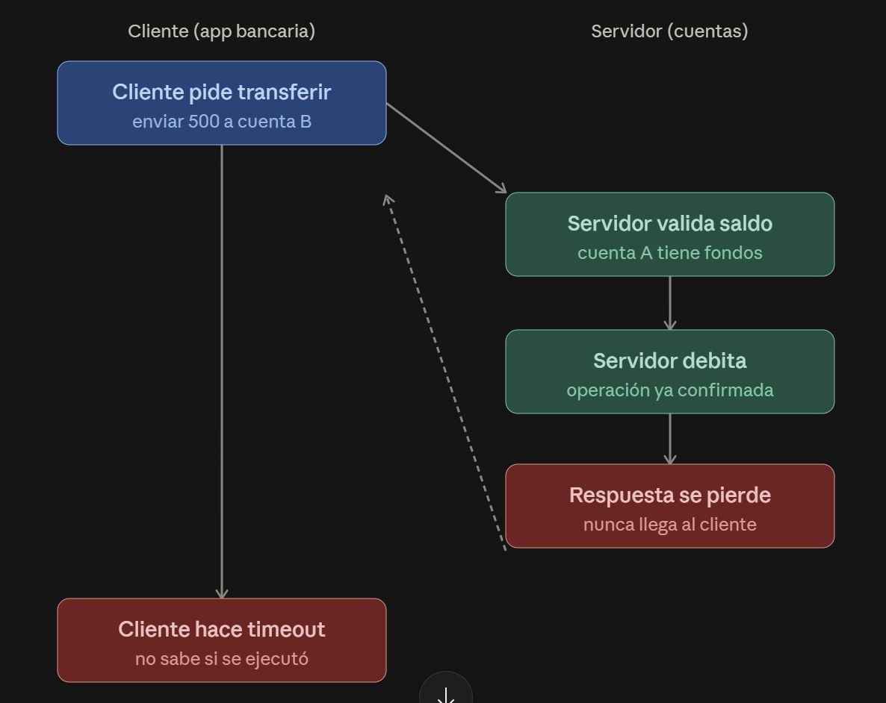
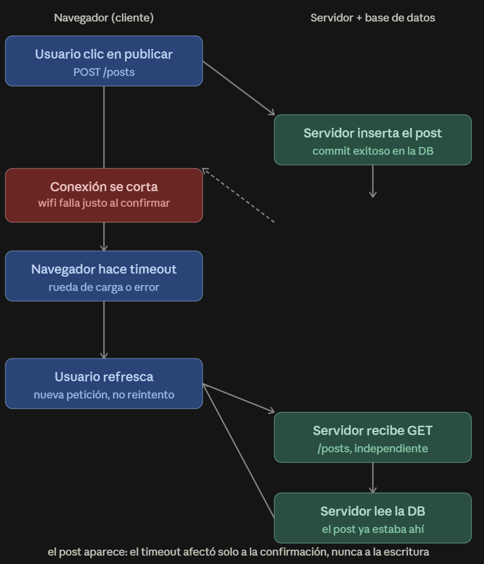
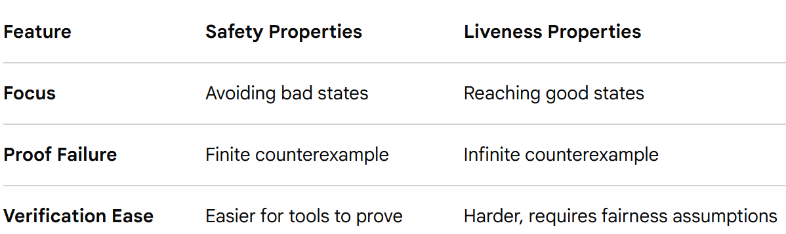
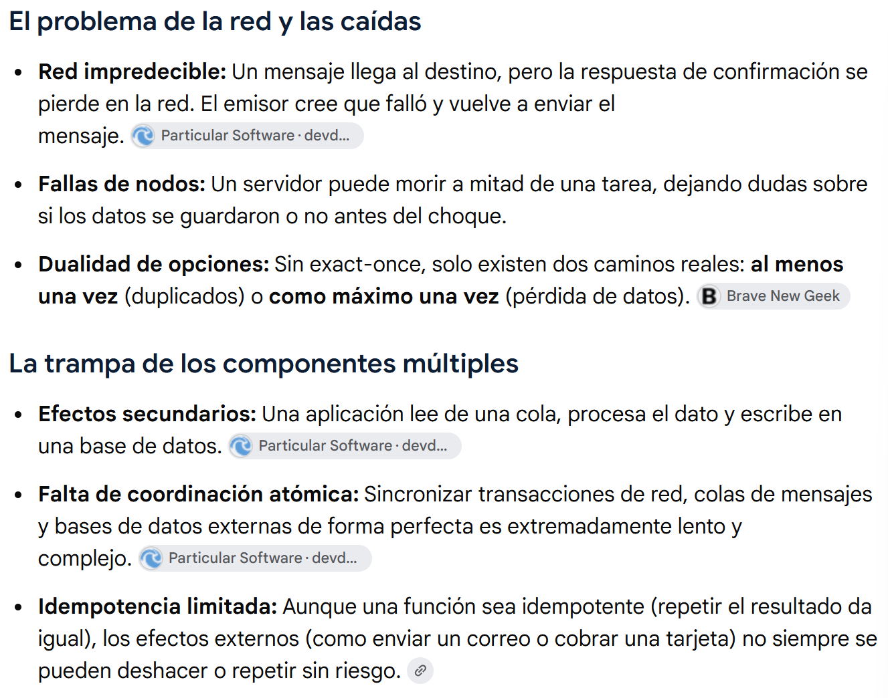

**Nivel 1**: fundamentos y reconocimiento

1) RCP: Remote Procedure Call. Intenta ocultarla existencia de la red. En un sistema robusto se gestoina la red, 
no se oculta. Pero un llamado en la red tiene overhead, latencia. No podemos asimilarlo a llamar una función. 
El problema clave es lidiar con la incertidumbre, ¿la operación se ejecutó o no?

El Remote Procedure Call (RPC) intenta abstraer el hecho de que una llamada a una función o método se está ejecutando en 
otra máquina (o proceso) distinta a la que hace la llamada.

Cosas concretas que oculta/abstrae
* La comunicación de red: sockets, protocolos de transporte (TCP/HTTP), serialización y deserialización de datos.
* La ubicación física: el cliente no necesita saber en qué máquina, proceso o contenedor vive el servicio.
* El formato de los datos: los parámetros y el valor de retorno se empaquetan (marshalling) y desempaquetan (unmarshalling) automáticamente — típicamente con algo como Protocol Buffers, JSON, XML, etc.
* Los detalles del transporte: si usa sockets crudos, HTTP/2, colas de mensajes, etc.

Funciona tan bien en el caso feliz que el programador empieza a razonar sobre el código como si fuera una llamada local, y ahí es donde aparecen los problemas.

Cuando ves resultado = calcularImpuesto(monto, pais), tu cerebro aplica el modelo mental de una función local:

* Se ejecuta rápido (nanosegundos/microsegundos)
* Siempre termina: o devuelve un valor, o lanza una excepción — no hay estado intermedio raro
* Es atómica respecto a fallos: si falla, no dejó "medio hecho" nada
* La memoria es compartida: no hay que serializar/copiar datos

Ninguna de estas garantías es cierta en una llamada remota, pero la sintaxis idéntica hace que el desarrollador las asuma sin darse cuenta.

* Consecuencias concretas de esa falsa suposición
* No manejar timeouts: si asumís que la llamada "siempre vuelve", no le pones límite de tiempo, y un servidor lento puede colgar tu aplicación entera.
* No manejar fallos parciales: en una llamada local, si algo sale mal, sabés que no pasó nada. En RPC, la llamada puede fallar en la red después de que el servidor ya ejecutó la operación (por ejemplo, ya cobró la tarjeta) pero antes de que la respuesta te llegue. No sabés si se ejecutó, si no se ejecutó, o si se ejecutó dos veces.
* No pensar en idempotencia: como no esperás fallos raros, no diseñás la operación para que sea segura reintentarla.
* Ignorar el costo de latencia: hacer 50 "llamadas a función" en un loop es gratis localmente, pero si cada una es un RPC, son 50 viajes de red — esto se conoce como el problema de las "chatty APIs".
* Asumir que los datos son los mismos: en memoria compartida, un objeto pasado por referencia sigue siendo el mismo objeto. En RPC, se serializa una copia — cambios posteriores en el objeto original no se reflejan del lado remoto.

2)
* Fiabilidad: fallos parciales vs. todo-o-nada
Local: una función o se ejecuta completa y devuelve un resultado, o falla con una excepción. No hay término medio — el estado del programa antes y después es predecible.
Remota: la llamada puede fallar en cualquier punto del camino (al enviar, al ejecutar del lado del servidor, al volver la respuesta). Esto genera un problema clásico: no sabés si la operación se ejecutó o no. Si se cae la conexión después de que el servidor procesó la petición pero antes de que la respuesta te llegue, desde tu lado es indistinguible de si nunca se ejecutó.

* Latencia: nanosegundos vs. milisegundos (o más)
Local: una llamada a función cuesta unos pocos ciclos de CPU — prácticamente gratis, del orden de nanosegundos.
Remota: implica al menos un viaje de red (round-trip), con latencia de milisegundos o más, dependiendo de la distancia, congestión, etc. Esto importa mucho en diseño: hacer 100 llamadas locales en un loop no cuesta nada; hacer 100 RPCs en un loop puede tardar segundos. De ahí el problema de las "chatty APIs".

* Semántica de memoria: paso por referencia vs. copia serializada
Local: si pasás un objeto por referencia, ambas partes (llamador y función) apuntan al mismo espacio de memoria. Un cambio en un lado se ve reflejado en el otro.
Remota: los datos tienen que serializarse (marshalling) para viajar por la red, y deserializarse del otro lado. Lo que llega es siempre una copia, nunca el objeto original. Esto rompe suposiciones como "si modifico el objeto después de pasarlo, la función ve el cambio".

* Concurrencia y orden de ejecución
Local: dentro de un mismo proceso/hilo, las llamadas suelen tener un orden determinístico y previsible.
Remota: los paquetes pueden llegar desordenados, duplicarse, o perderse en la red. Esto obliga a pensar en idempotencia (¿qué pasa si la misma llamada se ejecuta dos veces por un reintento?) y en mecanismos de deduplicación — algo que nunca hace falta en una llamada local.

* Seguridad y confianza
Local: la función que llamás vive en el mismo proceso, con el mismo nivel de privilegios y sin necesidad de autenticación — confiás implícitamente en el código porque es "tuyo".
Remota: cruza un límite de confianza. Hay que autenticar quién hace la llamada, autorizar si tiene permiso para ejecutarla, y potencialmente cifrar los datos en tránsito (TLS). Esto agrega complejidad que no existe en el mundo local.

* Manejo de errores: tipos de error distintos
Local: los errores son de tu propio dominio — excepciones que vos definiste, con causas que podés inspeccionar en el mismo proceso.
Remota: aparecen categorías de error que no existen localmente — timeout, conexión rechazada, DNS no resuelve, servidor caído, versión incompatible del protocolo. El llamador tiene que distinguir entre "la función falló" y "no pude ni contactar a la función", algo que en local ni siquiera es un concepto.

* Dependencia de una red imperfecta, con fallas y puntos donde se puede caer. 

3) Etapas:

* Envío del request
* Recepción en servidor
* Ejecución
* Envío de respuesta
* Recepción en cliente

Cada una de las etapas puede fallar independienemente

4) Antes del timeout:
* El cliente envía la solicitud, el servidor la recibe y comienza a procesar. 
* Si no llega respuesta a tiempo, el cliente reintenta; para el servidor ese reintento es una posible solicitud duplicada.  (no sabe si la primera se eprdió o sigue en curso o terminó)
* Cuadno se alcanza/vence el timeout para el cliente, este considera que la lalmada falló y sigue su lógica (error, fallback, reintento) pero no sabe que hace el servidor.

Cuando el cleitne ya dejó de esperar:
* El servidor quizás sigue ejecutando y termina la operación igual. NO sabe que el cleinte ya dejó de esperar. 
* Envía rta que llega tarde. Si el cleinte ya no está esperando, la rta se descarta o pierde. 

Riesgos:
* Duplicación
* Desperdicio de trabajo (completa resutlado de una tarea que ya nadie va a usar)

Esto ilustra dos riesgos clásicos de las llamadas remotas con timeout: duplicación (si la operación no es idempotente, procesar el reintento puede ejecutar la acción dos veces) y desperdicio de trabajo (el servidor completa una tarea cuyo resultado nadie va a usar). Por eso en sistemas reales se suelen usar identificadores de solicitud (idempotency keys) y cancelación cooperativa para mitigar ambos problemas

5) Modelo una llamada de un cliente a un servidor remoto sobre una conexión TCP, recorriendo las capas que participan cuando algo falla — desde la aplicación hasta el cableado físico.

Aplicación (cliente RPC/HTTP y su lógica de timeout)

Respuesta ante la falla: si no llega respuesta dentro del timeout configurado, el cliente da la llamada por perdida, cierra o abandona la espera del socket, y puede reintentar o propagar un error hacia arriba.
Ayuda al diagnóstico: es la capa donde el usuario final nota el problema, y suele registrar contexto útil (qué operación, con qué parámetros, cuánto tardó).
Complica el diagnóstico: el timeout es un límite arbitrario elegido por el desarrollador, no una señal de red real. Un timeout corto puede reportar "falla" cuando en realidad la respuesta solo iba lenta, mezclando "no funcionó" con "tardó más de lo esperado".

Transporte (TCP)

Respuesta ante la falla: TCP reintenta retransmitir segmentos no confirmados con backoff exponencial: si no recibe ACK tras varios intentos, termina la conexión (RST) o la deja expirar.
Ayuda al diagnóstico: separa "el paquete se perdió una vez" (TCP lo repara solo, invisible para la aplicación) de "la conexión está realmente rota" (TCP se rinde y notifica un error de socket).
Complica el diagnóstico: los reintentos de TCP sonocultos para la aplicación, así que un problema de red intermitente puede parecer "todo funciona lento" en vez de mostrarse como errores concretos, y el tiempo que TCP gasta reintentando se suma silenciosamente al timeout de la aplicación.

Red (IP y enrutamiento)

Respuesta ante la falla: si un router no puede reenviar un paquete (destino inalcanzable, TTL agotado), puede responder con un mensaje ICMP; si no, simplemente descarta el paquete sin avisar a nadie.
Ayuda al diagnóstico: ICMP (cuando llega) da una pista concreta del punto de fallo en la ruta (herramientas como traceroute se apoyan en esto).
Complica el diagnóstico: muchos firewalls bloquean ICMP por seguridad, así que en la práctica el paquete simplemente desaparece — no hay ninguna señal explícita, solo silencio, y hay que inferir la pérdida indirectamente.

Enlace de datos (Ethernet / Wi-Fi)

Respuesta ante la falla: en Ethernet cableado, errores de trama se detectan por checksum y el frame se descarta; en Wi-Fi hay reintentos a nivel de enlace antes de darle el paquete a IP.
Ayuda al diagnóstico: los contadores de errores de la interfaz de red (CRC errors, colisiones, frames descartados) permiten distinguir un problema de cableado/interferencia de un problema más arriba en la pila.
Complica el diagnóstico: estos contadores rara vez son visibles para quien diagnostica el problema desde la aplicación; hace falta acceso a la infraestructura de red o al switch para verlos.

Física (cableado, señal, hardware de red)

Respuesta ante la falla: no hay "respuesta" lógica — un cable cortado, una interfaz caída o una señal degradada simplemente deja de transmitir bits, y esto suele reflejarse como la interfaz cayendo (link down).
Ayuda al diagnóstico: cuando existe, el evento de "link down" es una señal muy clara y binaria (o hay conexión física o no la hay).
Complica el diagnóstico: los fallos intermitentes o parciales (cable con mal contacto, interferencia) no siempre generan un evento claro, y desde las capas superiores esto se ve idéntico a cualquier otra pérdida de paquetes.

El patrón general: cada capa hacia abajo tiene menos contexto sobre "qué" se estaba haciendo pero información más precisa sobre "dónde" ocurrió el problema físico; cada capa hacia arriba tiene más contexto de negocio pero ve el fallo ya filtrado (o directamente oculto) por los reintentos de las capas inferiores. Por eso diagnosticar un timeout intermitente casi nunca se resuelve mirando una sola capa — típicamente hace falta correlacionar logs de aplicación, estadísticas de TCP (retransmisiones, RTT) y contadores de la interfaz de red para saber si el problema es de código, de congestión, o físico.

**Nivel 2**: ejecuciones y fallas

1) ⛔ La red rompe la transparencia de las RPC porque la comunicación local y la comunicación por red tienen diferencias físicas inevitables.
La latencia de la red es alta, los paquetes se pierden y las computadoras independeintes pueden fallar por separado. 

**Latencia y rendimiento:**
+ Funcion local --> nanosegundos, red --> milisegundos
+ Uso de la red cambia el tiempo de respuesta total del sistema radicalmente. 

**Fallos parciales:**
+ Si trabajo en una sóla máquina, el programa falla y se detiene todo.
+ En la red, una máquina puede morir y las otras siguen funcionando
+ El clietne no sabe si la orden llegó al servidor antes del corte de conexión

**Acceso a memoria compartida:**
+ Las funciones locales pueden pasar datos usando apuntadores o referencias de memoria.
+ La red exige empaquetar y desempaquetar los datos (marshalling) porque las máquinas no comparten memoria física.

**Concurrencia y estado:**
+ Conexiones de red sufren retrasos y reordenamiento de paquetes. 
+ Gestionar estados compoartidos por medio de WI-FI o cables es más complejo que tratando dentro de un mismo sistema operativo

2) 

El caso concreto: el cliente pide transferir 500 de la cuenta A a la cuenta B. El servidor valida el saldo, confirma el débito en su base de datos —la operación ya es un hecho, el dinero salió de la cuenta A— y genera la respuesta de éxito. Pero esa respuesta se pierde en la red (un router la descarta, la conexión se cae, el proceso del cliente muere justo antes de leerla) y nunca llega. El cliente, al agotar su timeout, no tiene ningún dato: desde su punto de vista, la llamada "falló", pero en realidad la operación se ejecutó por completo.

Lo importante es que el fallo ocurrió después del punto de no retorno. La ejecución y el envío de la respuesta son dos eventos separados por la red, y cualquier cosa puede fallar entre uno y otro sin que el resultado de la operación cambie.

Con esa información, el cliente queda frente a tres posibilidades indistinguibles entre sí:

La solicitud nunca llegó al servidor → no se ejecutó nada.
Llegó, pero el servidor falló antes de completar el débito → no se ejecutó nada.
Se ejecutó y confirmó, pero la respuesta se perdió → sí se ejecutó (este caso).

Esto es exactamente lo que hace peligroso reintentar a ciegas: si el cliente reintenta pensando en el caso 1 o 2, pero en realidad estaba en el caso 3, se debita la cuenta A por segunda vez. En sistemas reales esto se resuelve de dos formas complementarias:

Idempotency key: el cliente genera un identificador único por intento lógico de transferencia (no por reintento), y el servidor lo guarda junto con el resultado. Si llega dos veces la misma clave, devuelve el resultado ya calculado en vez de ejecutar de nuevo.
Consulta de estado: en vez de reintentar la operación directamente, el cliente pregunta "¿qué pasó con la transferencia X?" antes de decidir si reintentar, cerrando la ambigüedad sin arriesgar un doble débito.

3) Un timeout (tiempo de espera máximo) es un límite de tiempo fijado para una operación de red o comunicación. Si un nodo o servicio no responde antes de ese plazo, el sistema cancela la acción de forma automática para evitar bloqueos y liberar recursos.
Entonces:
+ Evita bloqueos infinitos
+ Libera recursos
+ Aísla fallos

Problemas comunes:
+ Falsos positivos (se puede dar una tarea por perdida cuadno sólo estaba demorada)
+ Si los tiempos no están bien medidos entre microservisios, el retraso se multiplica y empeora el servicio

https://harish-bhattbhatt.medium.com/timeout-in-a-distributed-system-microservices-4fa36c611850

4) Un timeout (se agota el teimpo de espera) ocurre cuando una operación tarda más de lo previsto en responder. 
No implica crash (cierre o fallo abrupto del programa) porque el sisetma detecta la demora a tiempo, detiene esa tarea de forma controlada, segura y continua sin rompoerse.

Timeout (Controlado):
* El programa pone un reloj o límite de tiempo (por ejemplo, 5 segundos).
* Si pasa el tiempo, salta una alerta o excepción planeada (TimeoutException).
* El código atrapa el error, libera los recursos y sigue vivo.

Crash (Incontrolado):
* Ocurre un error grave no previsto (como dividir por cero o leer memoria dañada).
* El sistema operativo mata el proceso de forma abrupta.
* La aplicación se apaga o se cierra sola por completo

5) 

La petición que hizo timeout fue un POST /posts — pedía escribir algo, y su respuesta se perdió después de que el servidor ya había hecho el commit en la base de datos.
Al refrescar, el navegador hace un GET /posts — pide leer el estado actual. Esa petición no tiene ninguna relación con el POST anterior: es una conexión nueva, sin memoria de que hubo un timeout antes.

**Nivel 3**: diseño y comparación

1) ⛔ contaría el ejemplo de el push interrumpido?
* El wifi se corta a mitad de la transferencia de objetos. El servidor detecta la conexión rota (no espera nada, se entera al instante porque el socket falla).
* git push está diseñado para que la actualización de la referencia remota (el branch) sea el último paso, todo-o-nada: si la transferencia no se completó, el servidor simplemente descarta los objetos parciales que recibió y nunca toca el branch. No hay un "medio commit" ni un estado a medio camino.
* El cliente recibe un error explícito casi de inmediato — algo como fatal: the remote end hung up unexpectedly o error: RPC failed; curl transfer closed. No hubo timeout: la falla se detectó por una señal de red real (conexión rota), no por silencio prolongado.
* Y lo más importante: acá el cliente sí sabe con certeza que la operación falló, porque el estado remoto (el branch sin cambios) coincide exactamente con lo que el error sugiere. No hace falta "consultar" nada para despejar dudas — a diferencia del caso SSH o del blog, esta vez no hay ambigüedad que resolver.

Dos personas entran a comprar entradas para el mismo show al mismo tiempo, y a las dos les queda un solo asiento disponible en pantalla — el mismo asiento, porque ambas páginas se cargaron con datos casi simultáneos.

Las dos apretan "confirmar" casi al mismo instante.
El servidor recibe ambas solicitudes, pero las procesa una por una: una llega primero (por una diferencia de milisegundos) y el asiento se marca como ocupado a tu nombre.
Cuando llega la solicitud de la otra persona, el servidor chequea "¿este asiento sigue libre?" y la respuesta es no. Le devuelve un error inmediato: "este asiento ya no está disponible".

2) El sentido de la longitud de un timeout se lo da la duración del erquest correspondiente. 
https://codescoddler.medium.com/how-do-you-choose-the-right-timeout-1ed402847f79
TIMEOUT CORTO:
:) Libera recursos de inmediato, detecta ráidamente los fallos y mejora seguridad al cerrar sesiones inactivas
:( Puede cortar procesos legítimos si la red o el servidor están lentos

Conviene usarlo en sistemas de tiempo real, interfaces de usuario interactivas o conexiones internas estables y rápidas

Tiempo real --> no me sirve que llegue más tarde
Interfaz usuario --> entorpece la experiencia
Conexión interna estable --> servidores datacenter, la conexión es de 5ms. Si va por 2 s, algo raro pasó. 

TIMEOUT LARGO:
:) Evita errores por demoras temporales de red y permite terminar tareas pesadas o complejas.
:( Hace que los usuarios esperen mucho tiempo si hay un fallo real y acumula conexiones colgadas consumiendo memoria o recursos del servidor.

En conexiones móviles inestables, subidas/descargas de archivos grandes o consultas lentas a bases de datos

3) Un retry es un reintento de la operación tras un timeout. Reintenta igual, aunque no se sepa si la ejecución ocurrio. 
El obejetivo es superar fallos temporales en sistemas informáticos al volver a ejecutar una operación que falló. 
Logra así:
+ recuperación rápida
+ menos errores visibles
+ mayor estabilidad

4) Sea una operación con dos eventos posibles en el servidor:

* E: la ejecución de la operación (efecto secundario aplicado).
* R: la respuesta enviada de vuelta al cliente.

Y sea A: el cliente recibe la respuesta.

El camino "feliz" es la secuencia E → R → A. Pero como el canal puede fallar en cualquier tramo, hay tres puntos de corte posibles:

* Corte antes de E: la solicitud se pierde. E nunca ocurre.
* Corte entre E y R: E ocurre, pero R no se genera o no sale.
* Corte entre R y A: E y R ocurren, pero A nunca pasa (el caso de la transferencia bancaria y del blog que vimos antes).

Desde la perspectiva del cliente, los tres cortes son observacionalmente idénticos: en los tres casos, el cliente simplemente no recibe respuesta y su timeout vence. No existe ninguna señal disponible en el cliente que le permita distinguir en cuál de los tres estuvo.

Dado que el cliente no puede distinguir los tres casos, tiene solo dos opciones: no reintentar (arriesgando dejar sin completar una operación que en realidad falló en el corte 1) o reintentar (arriesgando repetir una operación que en realidad ya ocurrió, corte 3). La mayoría de los sistemas eligen reintentar, porque estadísticamente el corte 1 y 2 (fallo real) son más comunes que el corte 3 (fallo de confirmación) — pero elegir reintentar es, por construcción, aceptar la posibilidad del corte 3 como costo.

Formalmente, esto define la semántica del retry como "at-least-once": la operación se ejecuta como mínimo una vez, pero puede ejecutarse más de una vez, nunca menos. La única forma de tener "exactly-once" real requeriría una señal de confirmación con cero probabilidad de pérdida — lo cual, dado el mismo argumento del canal no confiable aplicado recursivamente a esa señal, es imposible en general (la confirmación de la confirmación también podría perderse).

5) Un reintento puede ser tanto automático como manual. ⛔
+ Usuario agrega el producto X al carrito
+ Se envía la solicitud al servidor
+ El servidor ya procesó el alta (X quedó registrado), pero la respuesta todavía no llegó
+ La UI no se actualiza (sigue mostrando el carrito sin X) ⛔
+ El usuario, sin feedback, asume que falló y vuelve a apretar "agregar" sobre el mismo producto X (retry manual)
+ Esa segunda solicitud también se procesa: el servidor no tiene forma de saber que es un reintento de la misma acción
+ Llegan (tarde) las dos respuestas / se refresca la pantalla
+ El usuario ve X duplicado (cantidad 2, o dos líneas) en el carrito

**Nivel 4**: integración y defensa

1) https://www.geeksforgeeks.org/system-design/retries-strategies-in-distributed-systems/
El exceso de retries sin control sobrecarga y satura los servidores con tráfico duplicado, lo que genera una "retry storm".
Eleva la altencia, agota los recursos de CPU y memoria y puede causar la caída total o el bloqueo en cadena de servicios dependientes. 

Impacto en el sistema:
+ Sobrecarga de tráfico: Multiplica el volumen de peticiones enviadas al servidor que ya presenta fallas.
+ Agotamiento de recursos: Consume conexiones de bases de datos, hilos de ejecución y memoria RAM.
+ Mayor latencia: Retrasa las respuestas válidas y acumula tiempo de espera (timeout) en toda la cadena.
+ Efecto cascada: Propaga el fallo inicial a otros microservicios conectados

*Una tormenta de reintentos (retry storm) ocurre cuando un servicio falla o se vuelve lento, y los clientes reintentan enviar sus peticiones de forma masiva. Esta avalancha multiplica el tráfico y satura aún más el servidor, lo que impide que se recupere y puede causar una caída total del sistema.
https://twitter.github.io/finagle/guide/Glossary.html

2) 
https://www.hillelwayne.com/post/safety-and-liveness/

Safety = que no ocurra algo incorrecto
Liveness = que la operación eventualmente avance

|              | **Sin retry**                                                                | **Con retry**                                                                                |
| ------------ | ---------------------------------------------------------------------------- | -------------------------------------------------------------------------------------------- |
| **Liveness** | ↓ Menor. Si falla una comunicación, la operación puede quedar sin completar. | ↑ Mayor. Si falla una comunicación temporalmente, se vuelve a intentar.                      |
| **Safety**   | ↑ Mayor en cuanto a duplicaciones. No se ejecuta nuevamente por un retry.    | ↓ Puede disminuir porque una operación puede ejecutarse varias veces si no hay idempotencia. |

3)
At least once: el sistema reintenta hasta obtener respuesta. Mejora liveness pero genera múltiples ejecuciones. 
At most once: evita la duplicación pero puede perder la ejecución
Exactly once: requiere coordinación fuerte o se implementa como combinación de at least once + idempotencia

4) 
At least once: Un pago con tarjeta de crédito en línea. Si la red falla
después de enviar la solicitud, el sistema reintenta para asegurarse
de que el pago se procese, pero puede producirse un doble cargo.

At most once: El envío de métricas de rendimiento (por ejemplo, uso
de CPU). Si un paquete se pierde, no se reintenta porque es preferible
perder una métrica antes que generar tráfico o duplicados.
Streaming? ⛔

Exactly once: Una transferencia bancaria identificada con un ID único.
Aunque el cliente reintente por un fallo de red, el servidor detecta
que la transferencia ya fue procesada y evita ejecutarla nuevamente.
5) Garantizar el procesamiento "exactamente una vez" (exactly-once) es muy difícil en sistemas distribuidos porque la red es poco confiable, los servidores pueden fallar en cualquier momento y la pérdida de confirmaciones (acks) obliga a reintentar operaciones, lo que genera duplicados inevitables.

