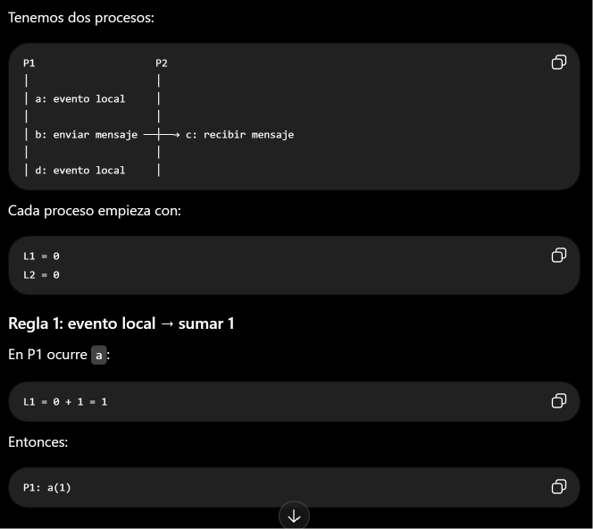
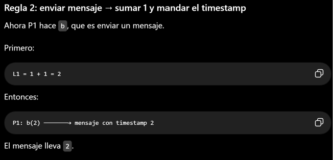
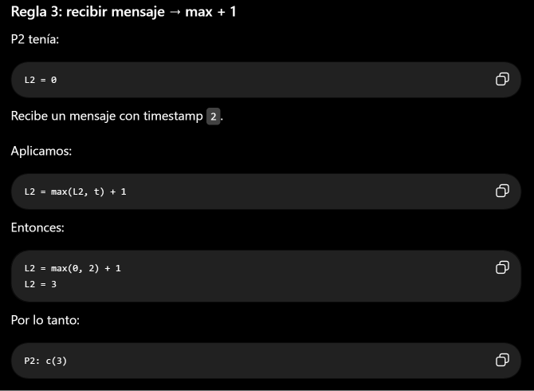
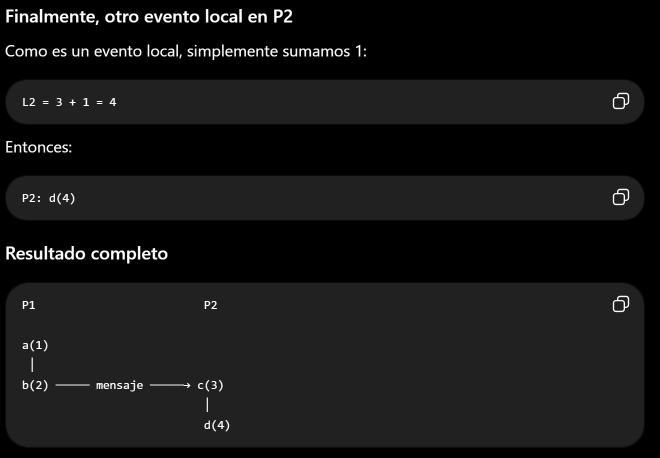
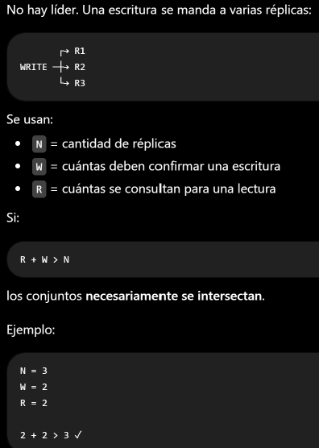

## Nivel 1: fundamentos y reconocimiento

https://www.geeksforgeeks.org/operating-systems/what-is-replication-in-distributed-system/

1) La replicación en sistemas distribuídos se pueede definir como el proceso de crear y mantener múltiples copias de datos, recursos o servicios en diferentes 
nodos (sean estos nodos o servidores) dentro de una red. El objetivo es mejorar la confiabilidad, la disponibilidad y rendimietno del sistema, aseguranod que los 
datos o servicios sean accesibles incluso si algunos nodos fallan o dejan de estar disponibles.

Enceuntra su origen en un problema central: el estado. Para mejorar disponibilidad y latencia, los sistemas replican datos. Introduce una dificultad fundamental:

**no se pueden mantener todas las copias perfectametne sinronizadas sin coordinación**

2) La divergencia es inevitable debido a la latencia de la red y la posiblidad de particoines de red, lo que impide que múltiples nodos mantengan un estado ide´ntico de manera instantánea y simultánea.

3) 
| Momento               | Réplica A | Réplica B |
| --------------------- | --------- | --------- |
| Inicial               | `x = 0`   | `x = 0`   |
| Escritura concurrente | `x = 1`   | `x = 2`   |
| Resultado             | `x = 1`   | `x = 2`   |

4) Estado físico: lo que realmente está almacenado en cada réplica en ese momento
Puede diferir entre las réplicas

Estado lógico: estado que el sistema considera que represetna correctamente los datos, independeintementee de cómo estén distribuídos físicamente
Si el sistema detecta una escritura concurrente entre x=1 y x=2 pude considerar:

```Estado lógico --> x tiene un conflicto entre 1 y 2 ```

y posteriormente resolverlo, mediante Last Write Wins como:

```estado lógico final --> x=2```

Aunque temporalmetne las réplcias aún estén defasadas. 

|                              | Estado físico                 | Estado lógico                                    |
| ---------------------------- | ----------------------------- | ------------------------------------------------ |
| Qué representa               | Lo almacenado en cada réplica | El estado que el sistema considera válido        |
| Puede diferir entre réplicas | **Sí**                        | Idealmente **no**, una vez resuelto el conflicto |
| Ejemplo                      | A: `x=1`, B: `x=2`            | `x=2` después de resolver                        |
| Depende de                   | Estado local de cada réplica  | Reglas de consistencia/conflict resolution       |

El estado físico corresponde a los datos actualmente almacenados en cada réplica, mientras que el estado lógico representa la visión consistente del sistema sobre esos datos, independientemente de las diferencias temporales entre las réplicas.
⛔ Fïsicamente no está en ningún lugar el lógico, cierto?

5) Porque ante cualquier duda (ya que ningún nodo está exento de sufrir degradación de la información)
si sólo tengo una sola fuente de verdad y se corrompe no puedo reconstruir la información correcta o "desempatar". Mínimo y de preferencia 3 nodos par decidir cual tiene razón

Una sola fuente de verdad es difícil de sostener ante una partición porque los demás nodos pueden quedar incomunicados con ella. Si el nodo que actúa como fuente de verdad queda aislado, los otros nodos no pueden consultar ni actualizar ese estado, lo que afecta la disponibilidad. Si, en cambio, se permite que ambos lados de la partición acepten escrituras, pueden generarse estados divergentes que luego deben reconciliarse. Por eso los sistemas replicados utilizan múltiples réplicas y mecanismos de consenso o resolución de conflictos.

## Nivel 2: ejecuciones y fallas

1) Linearizabilidad: garantía de consistencia fuerte en sistemas concurrentes y distribuídos, donde cada operación parece ocurrir de forma instantánea en un punto específico del tiempo real entre su invocación y su respuesta
Ejemplo (registro compartido): x = 0 (cómo falla en un sistema no linearizable)

Cliente A: WRITE(x, 1)
Cliente B: READ(x)

Tiempo ──────────────────────────────>

A:  WRITE(x,1) ──────── respuesta
B:             READ(x) ────────→ devuelve 0


Devuelve: READ(x) → 0

Pero si el sistema fuera linearizable, debería devolver 1. 

La linearizabilidad exige que podamos imaginar cada operación como si hubiera ocurrido instantáneamente entre su invocación y su respuesta, respetando además el orden temporal real entre operaciones que no se solapan.
En criollo:
Aunque haya muchas operaciones ocurriendo al mismo tiempo, el resultado debe ser como si las operaciones hubieran ocurrido una por una, en algún orden, y respetando el tiempo real.

La oepración no dura realmente 0 tiempo, significa que se hizo efectiva en un momento puntual. 

2) Conistencia causal según la relación happens-before (-->):
* orden de programa
* envío/recepción de mensajes
* transitividad entre relaciones conocidas

La consistencia causal exige que si a --> b, entonces todo proceso observa a antes que b

3) Dos timestamps físicos de nodos distintos no alcanzan para decidir causalidad entre eventos porque
los relojes físicos de dos nodos pueden estar desincronizados. Entonces comparar sus timestamps no permite saber con certeza qué evento
ocurrió antes causalmente. 

A: evento E1 → timestamp 10:00:05
       ↓
       mensaje
       ↓
B: evento E2 → timestamp 10:00:00

4) 




5) Linearizabilidad respeta el tiempo real mientras que consistencia causal espeta solamente las relaciones de causa --> efecto

Una ejecución puede ser causalmente consistente pero no linearizable porque la consistencia causal permite que una operación vea un estado viejo si no existe una relación causal, mientras que la linearizabilidad además exige respetar el orden temporal de las operaciones que no se solapan.

Causalidad:

"Si A provocó B, entonces B tiene que enterarse de A." Puede que no lo conozca si aún no se sincronizaron

Linearizabilidad:

"Si A terminó antes de que B empezara, B tiene que comportarse como si A ya hubiera pasado."

WRITE(1)   ||   READ(0)
          concurrentes

WRITE(1) ──────┐
               └── termina

                  READ() ───→ 0

## Nivel 3: diseño y comparación

1) La consistencia eventual es una garantía de convergencia, según la cual:

"Si no hay nuevas escrituras, todas las réplicas convergen al mismo valor"

No garantiza orden ni lecturas recientes. 

Los límites de la consistencia eventual son las ventanas de tiempo impredecibles y los estados transitorios donde distintas partes de un sistema distribuido muestran información desactualizada o contradictoria antes de sincronizarse.
* Incosistencia temporal
* Falta de un reloj exacto
* Lecturas anómalas
* Conflictos de concurrencia
* FAlta de garantías ACID🫨 --> no hay atomicidad acá

3) Leader-based: como todas las escrituras pasan por el mismo lugar, es fácil mantener un orden único de escrituras. 
La forma *síncrona* hace que el líder espere que las réplicas confirmen, lo caul asegura mayor consistencia, pero es más lenta. 
En la forma *asíncrona* el líder responde antes que todas las réplicas tengan el dato. Si bien es más rápida, una lectura de una réplica arasada puede dar un valor viejo. 

*Garantía*: generalmente es el modelo más fácil para ofrecer un orden consistente de escrituras, especialmente si la replicación es síncrona.

4) Multi-leader: hay varios líderes,por ejemplo, uno por región. Y cada uno puede aceptar escrituras. El problema surge si ocurren concurrentemente, dado que no hay un único líder que haya decidido cuál ocurrió primero. 

*GArantía*: puede haber conflictos y lecturas diferentes dependiendo de qué réplica consultes, hasta que el conflicto se resuelva.

5) LEaderless (dynamo):



Entonces, al leer 2 réplicas, al menos una debería ser una de las que recibió la escritura.

*Garantía*: puede ofrecer lecturas más consistentes mediante quórums, pero no significa automáticamente linearizabilidad. Depende de cómo se resuelvan versiones, conflictos y concurrencia.

2) 
| Modelo           | Escrituras     | Problema principal                         | Garantía observable                                              |
| ---------------- | -------------- | ------------------------------------------ | ---------------------------------------------------------------- |
| **Leader-based** | Un único líder | Líder puede ser cuello de botella/fallo    | Orden de escrituras más fácil de mantener                        |
| **Multi-leader** | Varios líderes | **Conflictos concurrentes**                | Puede observarse divergencia entre réplicas                      |
| **Leaderless**   | Cualquier nodo | Elegir `N`, `W`, `R` y resolver conflictos | Quórums pueden garantizar que lectura y escritura se intersecten |

##Nivel 4: integracipon y defensa