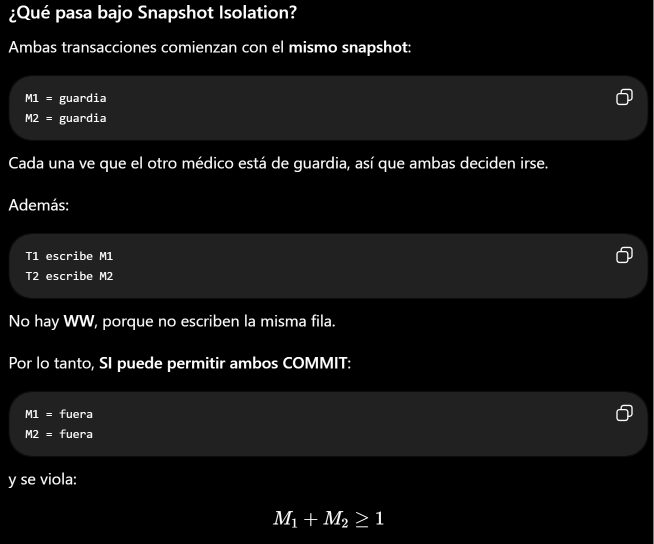
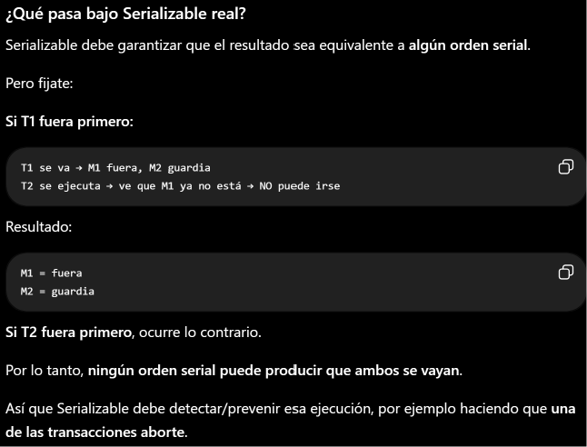
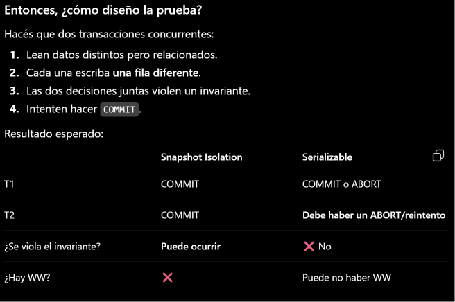

https://chatgpt.com/share/6aa2baf0-a05c-83e9-8e23-2e7f207827ae

## Nivel 1: fundamentos y reconocimiento

1) **ATOMICIDAD**: Una transacción se ejecuta completamente o no se ejecuta nada.

Si todas las operaciones de la transacción salen bien → se confirman.
Si alguna falla → se hace rollback y se deshacen las anteriores.

Problema que resuelve: evita que una transacción quede a medias.

Ejemplo: transferir $10.000 de A a B. No puede ocurrir que se descuenten de A pero nunca se acrediten en B.

**CONSISTENCIA**: Una transacción debe llevar la base de datos de un estado válido a otro estado válido, respetando todas sus restricciones e invariantes.

Problema que resuelve: evita que una transacción deje la base de datos en un estado inválido o incoherente.

Ejemplo: si existe una regla que impide que una cuenta tenga saldo negativo, una transacción no debería terminar violando esa regla.

**AISLAMIENTO**: Las transacciones concurrentes deben comportarse, según el nivel de aislamiento, como si no interfirieran incorrectamente entre sí.

Problema que resuelve: evita que las transacciones concurrentes produzcan interferencias o resultados incorrectos.

Ejemplo: dos transacciones intentan modificar el mismo saldo al mismo tiempo. El aislamiento evita que una lea/modifique datos intermedios de la otra de una manera que produzca un resultado incorrecto.

**DURABILIDAD**: Una vez que una transacción fue confirmada (commit), sus cambios deben persistir, incluso si después ocurre una falla del sistema.

Problema que resuelve: evita la pérdida de datos ya confirmados ante crashes, cortes de energía, etc.

Ejemplo: si el banco confirma una transferencia y justo después se cae el servidor, la transferencia no debería desaparecer.

| Propiedad        | Garantiza                                             | Problema que evita             |
| ---------------- | ----------------------------------------------------- | ------------------------------ |
| **Atomicidad**   | Todo o nada                                           | Transacciones incompletas      |
| **Consistencia** | Estado válido → estado válido                         | Datos/invariantes inválidos    |
| **Aislamiento**  | Correcta interacción entre transacciones concurrentes | Interferencias y anomalías     |
| **Durabilidad**  | Los commits sobreviven a fallos                       | Pérdida de cambios confirmados |

A → ¿Se hizo todo o nada?
C → ¿La BD quedó válida?
I → ¿Las transacciones se molestaron entre sí?
D → ¿Lo confirmado sobrevivió a una falla?

2) Atomicidad se refiere a una misma transacción, mientras que aislamiento se refiere a la interacción entre varias trnsacciones concurrentes.

Ejemplo: atomicidad preservada, aislamiento no

Supongamos que tenemos dos cuentas:

A = $100
B = $100

Y una transacción T1 que quiere transferir $50 de A a B:

T1:
1. A = A - 50       → A = 50
2. B = B + 50       → B = 150
3. COMMIT

La atomicidad se preserva: T1 realiza sus dos operaciones o, si falla antes del COMMIT, se deshacen ambas.

Ahora supongamos que concurrentemente ejecutamos T2, que consulta el saldo de A entre los pasos 1 y 2:

T1: A = A - 50      → A = 50
T2: lee A           → 50
T1: B = B + 50      → B = 150
T1: COMMIT

T2 pudo observar un estado intermedio de T1. Por lo tanto, el aislamiento no se preserva, aunque T1 siga siendo atómica.

Al revés: aislamiento preservado, atomicidad no

Imaginemos que T1 hace:

T1:
1. A = A - 50       → A = 50
2. falla el sistema
3. B = B + 50       ❌ nunca se ejecuta

Si el sistema garantiza aislamiento, otra transacción no verá necesariamente ese estado intermedio de T1.

Pero si no hay atomicidad, puede quedar:

A = 50
B = 100

La transferencia quedó a medias.

Atomicidad evita que una transacción quede parcialmente ejecutada (todo o nada), mientras que aislamiento evita que una transacción observe o interfiera incorrectamente con los estados intermedios de otras transacciones concurrentes.

Atomicidad → problema de ejecución incompleta.
Aislamiento → problema de concurrencia.

3) Hay que mirar operaciones de distintas trnsacciones que accedan al msimo dato
T1: R(A)        T2: W(A)
| Operación de T1 | Operación de T2 | Conflicto          | Ejemplo             |
| --------------- | --------------- | ------------------ | ------------------- |
| **R**           | **W**           | **RW**             | T1: R(A) → T2: W(A) |
| **W**           | **R**           | **WR**             | T1: W(A) → T2: R(A) |
| **W**           | **W**           | **WW**             | T1: W(A) → T2: W(A) |
| **R**           | **R**           | ❌ No hay conflicto | T1: R(A) → T2: R(A) |

Regla rápida

Para cada par de operaciones:

¿Son de transacciones diferentes?
¿Acceden al mismo dato?
¿Al menos una escribe?

Si las tres respuestas son sí, hay conflicto.

Y el tipo se determina por el orden:

R → W = RW
W → R = WR
W → W = WW
R → R = nada

4) Para construir el grafo de precedencia de un schedule, se transforman los conflictos enter transacciones en aristas dirigidas. 

Ejemplo

Supongamos este schedule:

R1(A)
W2(A)
W1(B)
R2(B)

Tenemos dos transacciones: T1 y T2.

1. Buscamos conflictos

R1(A) → W2(A)
Es un conflicto RW. Como T1 ocurre antes que T2:

T1 → T2

W1(B) → R2(B)
Es un conflicto WR. Como T1 ocurre antes que T2:

T1 → T2

No hace falta agregar dos veces la misma arista.

2. Construimos el grafo
T1 ─────→ T2
Nodos: una por cada transacción.
Aristas: una por cada dependencia causada por un conflicto.
3. ¿Es conflict-serializable?

La regla fundamental es:

Un schedule es conflict-serializable si y solo si su grafo de precedencia es acíclico.

En este caso:

T1 → T2

No hay ningún ciclo, por lo tanto:

✅ El schedule es conflict-serializable.

Además, el orden serial equivalente es:

T1 → T2
Ejemplo donde NO es serializable

Consideremos:

R1(A)
W2(A)
R2(B)
W1(B)

Los conflictos son:

R1(A) → W2(A) → T1 → T2
R2(B) → W1(B) → T2 → T1

El grafo queda:

      ┌──────→ T2
      │         │
      │         ↓
     T1 ←───────┘

Es decir:

T1 → T2
T2 → T1

Hay un ciclo:

T1 → T2 → T1

Por lo tanto:

❌ No es conflict-serializable.

Para resolver cualquier ejercicio

Podés seguir siempre estos 4 pasos:

Identificar las transacciones → nodos.
Buscar conflictos RW, WR y WW entre transacciones diferentes.
Agregar una arista Ti → Tj si la operación de Ti ocurre antes que la conflictiva de Tj.
Buscar ciclos:
Sin ciclo → ✅ conflict-serializable
Con ciclo → ❌ no conflict-serializable

R-R nunca genera una arista, porque dos lecturas no generan conflicto.

5) Orden serial equivalente: orden en que ejecuto las transacciones una después de la otra, sin intercalarlas, y que produce el mismo comportamiento relevante que el schedule original.

Ejemplo

Tenemos este schedule intercalado:

R1(A)
W1(A)
R2(B)
W2(B)
R1(C)
W2(C)

Las operaciones de T1 y T2 están mezcladas.

Un posible orden serial sería:

T1:
R1(A)
W1(A)
R1(C)

T2:
R2(B)
W2(B)
W2(C)

Es decir:

$$ \boxed{T1 \rightarrow T2} $$

Eso es serial porque primero termina completamente T1 y después empieza T2.

¿Cuándo es "equivalente"?

No alcanza con que tenga las mismas transacciones. El orden serial debe respetar los conflictos del schedule original.

Por ejemplo, si en el schedule original tenemos:

W1(A)
R2(A)

hay un conflicto WR, y obliga a:

$$ T1 \rightarrow T2 $$

Por lo tanto, un orden serial equivalente no podría ser:

$$ T2 \rightarrow T1 $$

porque estaría invirtiendo ese conflicto.

Relación con el grafo

Esta es justamente la utilidad del grafo de precedencia:

Sin ciclos → podemos encontrar un orden de las transacciones que respete todas las aristas → existe un orden serial equivalente.
Con ciclo → las restricciones se contradicen → no existe orden serial equivalente.

----------------------------------------------------------------------------------------------------------

La idea clave es que un ciclo impone requisitos de orden contradictorios.

Supongamos que el grafo tiene un ciclo:

$$ T_1 \rightarrow T_2 \rightarrow T_3 \rightarrow T_1 $$

Esto significa que, debido a conflictos del schedule original:

\(T_1\) debe ir antes que \(T_2\)
\(T_2\) debe ir antes que \(T_3\)
\(T_3\) debe ir antes que \(T_1\)

Entonces, cualquier orden serial equivalente tendría que cumplir:

$$ T_1 < T_2 < T_3 < T_1 $$

Pero esto es imposible: estaríamos exigiendo que \(T_1\) sea a la vez anterior y posterior a sí misma.

Por lo tanto, no existe ningún ordenamiento serial de las transacciones que pueda respetar todos los conflictos del schedule original.

Un ciclo en el grafo implica una cadena de dependencias que exige que una transacción preceda a otra, y que finalmente esta última preceda nuevamente a la primera. Como un orden serial debe ser lineal y no puede contener ciclos, no existe un orden serial equivalente. Por eso, un schedule con un ciclo no es conflict-serializable.

## Nivel 2: ejecuciones y fallas

1) Un dirty read ocurre cuando una transacción lee un dato que fue modificado por otra trnasacción, pero esa n¿modiciación todavía no fue confirmada con un COMMIT. 

Un dirty read ocurre cuando una transacción lee una modificación no confirmada de otra transacción. Si la transacción que realizó la modificación hace ABORT, el valor leído desaparece mediante el rollback, por lo que la segunda transacción había observado un estado que finalmente no pertenece al estado válido de la base de datos.

A=100

El schedule es:

T1: W(A = 50)
T2: R(A) → 50
T1: ABORT

Paso a paso:

T1 modifica A de 100 a 50.
T1 todavía no hizo COMMIT.
T2 lee A y obtiene 50.
T1 hace ABORT, por lo que su modificación se deshace:
$$ A \leftarrow 100 $$
¿Dónde está el problema?

T2 observó:

$$ A = 50 $$

pero ese valor nunca fue confirmado. Después del ABORT de T1, el valor válido vuelve a ser:

$$ A = 100 $$

Por eso se llama dirty read (lectura sucia): T2 leyó un dato que posteriormente fue deshecho.

Estado observable después del ABORT

Después de:

W1(A=50)
R2(A)       → T2 observa 50
ABORT1

el estado de la base queda:

A = 100

pero T2 ya había observado 50. Es decir, T2 pudo tomar decisiones basándose en un valor que finalmente no existió de manera válida.

2) Non-repeatable read ocurre cuando una transacción lee dos veces el mismo dato y obtiene valores diferentes, porque otra transacción lo modificó y confirmó entre ambas lecturas. 

Una non-repeatable read ocurre cuando una transacción lee dos veces el mismo dato y obtiene valores diferentes debido a una actualización confirmada por otra transacción entre ambas lecturas. Es posible en READ COMMITTED, pero no en REPEATABLE READ ni en SERIALIZABLE.

|                                   | Dirty read                     | Non-repeatable read                    |
| --------------------------------- | ------------------------------ | -------------------------------------- |
| ¿Cuántas veces lee T1?            | Una puede alcanzar             | **Dos**                                |
| ¿La otra transacción hizo COMMIT? | ❌ No                           | ✅ Sí                                   |
| ¿Puede haber ABORT?               | **Sí, es lo característico**   | No es necesario                        |
| Problema                          | Leí un valor **no confirmado** | El valor **cambió entre mis lecturas** |

Truquito para acordarte

Dirty:

"Leí algo sucio, que todavía no estaba confirmado."

Non-repeatable:

"Lo leí dos veces, pero no pude repetir el resultado."

Por ejemplo, pensalo como el saldo de una cuenta:

Dirty read:

"Vi $200, pero el cambio se canceló. En realidad nunca quedaron $200."

Non-repeatable read:

"Vi $100. Volví a mirar y ahora hay $200 porque alguien hizo una transferencia confirmada en el medio."

Dirty read: el problema es que se toma una decisión basándose en un dato que finalmente no existió
Non-repeatable read: el probelma es que no se puede confirmar que el dato que leyó siga siendo igual durante su transacción

3) (Predicado: condición que ponés en la consulta para decidir qué filas entran en el reultado. SELECT * FROM empleados WHERE salario > 1100; el predicado es salario>1100)
Un phantom read ocurre cuando una transacción ejecuta dos veces la misma consulta por predicado y, entre ambas consultas, otra transacción inserta, elimina o modifica una fila de manera que pasa a cumplir el predicado.

Un phantom read ocurre cuando una transacción ejecuta dos veces una consulta sobre un predicado y obtiene conjuntos de resultados diferentes porque otra transacción insertó, eliminó o modificó filas que cumplen dicho predicado entre ambas consultas.
En una base de datos real es totalmente esperable que se agreguen o eliminen datos mientras vos trabajás. El punto del phantom read no es que eso sea "incorrecto".

El problema aparece cuando tu transacción necesita trabajar como si estuviera viendo un conjunto estable de datos.

¿Por qué puede ser un problema?

Porque T1 podría estar haciendo algo que requiere que ese conjunto no cambie mientras dura su operación. Esto estaría sucediendo dentro e la msima transacción. 

| id | nombre | salario |
| -- | ------ | ------: |
| 1  | Ana    |    1000 |
| 2  | Juan   |    1200 |

T1 hace una consulta:

SELECT *
FROM Empleados
WHERE salario > 1100;

Obtiene:

Juan | 1200

Ahora T2 inserta un nuevo empleado:

INSERT INTO Empleados VALUES (3, 'Pedro', 1500);
COMMIT;

T1 vuelve a ejecutar exactamente la misma consulta:

SELECT *
FROM Empleados
WHERE salario > 1100;

Ahora obtiene:

Juan  | 1200
Pedro | 1500
¿Qué apareció?

Pedro es el "fantasma". 👻

No estaba en el resultado de la primera consulta, pero apareció en la segunda porque otra transacción insertó una fila que cumple el mismo predicado.

Diferencia con non-repeatable read

Esta distinción es importante:

Non-repeatable read:

La misma fila existe, pero cambia su valor.

T1: SELECT salario WHERE id=2 → 1200
T2: UPDATE ... SET salario=1500
T2: COMMIT
T1: SELECT salario WHERE id=2 → 1500

Phantom read:

Aparece o desaparece una fila completa del resultado de una consulta por predicado.

T1: SELECT * WHERE salario > 1100 → {Juan}
T2: INSERT Pedro (1500)
T2: COMMIT
T1: SELECT * WHERE salario > 1100 → {Juan, Pedro}

4) Write skew. Hay dos médicos de guardia. Sólo se pueden ir si queda otro. 
M1 mira y está M2 
M2 mira y está M1
Ambos deciden irse, ya no hay médicos!

Lo importante del write skew

No es que cada transacción haya hecho algo incorrecto individualmente:

T1: "Si M2 sigue, yo puedo irme." ✅
T2: "Si M1 sigue, yo puedo irme." ✅

El problema aparece por la combinación de ambas decisiones:

Cada una verifica el invariante usando un estado que era válido, pero las dos actualizaciones juntas hacen que el invariante deje de cumplirse.

Invariante: debe haber al menos un médico de guardia, es decir, \(M_1 + M_2 \geq 1\). El write skew ocurre porque ambas transacciones leen un estado en el que el invariante se cumple y, de forma concurrente, realizan actualizaciones que individualmente parecen válidas pero conjuntamente lo violan, dejando \(M_1+M_2=0\).

5) La clave está en que Snapshot Isolation controla qué versiones de los datos ve cada transacción, y además evita que dos transacciones hagan write-write sobre la misma fila al mismo tiempo. Pero eso no alcanza para evitar write skew, porque en el write skew cada transacción escribe una fila distinta.

1. ¿Por qué evita WW?

En Snapshot Isolation, cada transacción trabaja sobre un snapshot consistente.

Si dos transacciones intentan modificar la misma fila, por ejemplo:

T1: W(A)
T2: W(A)

hay un conflicto WW.

Snapshot Isolation detecta que ambas quieren escribir sobre A y no permite que las dos confirmen. Una debe abortar.

Por eso:

$$ \boxed{\text{SI evita conflictos WW}} $$
2. ¿Pero por qué permite write skew?

Volvamos a los médicos:

M1 = de guardia
M2 = de guardia

Tenemos:

$$ M_1 + M_2 \geq 1 $$

Ahora:

T1 (M1):
    lee M2 = de guardia
    → decide irse
    W(M1 = fuera)

T2 (M2):
    lee M1 = de guardia
    → decide irse
    W(M2 = fuera)

Fijate en algo fundamental:

T1 escribe M1
T2 escribe M2

No escriben la misma fila.

Por lo tanto, no hay WW:

$$ W_1(M_1) \quad\text{y}\quad W_2(M_2) $$

Como Snapshot Isolation principalmente detecta el conflicto cuando las dos quieren escribir el mismo dato, permite que ambas hagan COMMIT.

Resultado:

M1 = fuera
M2 = fuera

y:

$$ M_1 + M_2 = 0 $$

❌ Se viola el invariante.

La idea para memorizar

WW:

"Los dos quieren modificar el mismo dato."
→ SI lo detecta → uno aborta.

Write skew:

"Los dos modifican datos distintos, pero sus modificaciones juntas rompen una regla."
→ SI puede no detectarlo → ambos confirman.

Por eso:

$$ \boxed{\text{Snapshot Isolation evita WW, pero no garantiza la ausencia de write skew}} $$

Y esta es justamente una de las diferencias importantes entre Snapshot Isolation y Serializable: Serializable debe impedir también estas dependencias que, aunque no sean WW directos, producen un resultado no serializable.

## Nivel 3: diseño y comparación

1) Cuanto más fuerte es el nivel, menos anomalías permite. 
| Nivel                  | Dirty read | Non-repeatable read |                       Phantom read | Write skew |
| ---------------------- | ---------: | ------------------: | ---------------------------------: | ---------: |
| **Read Committed**     |          ❌ |                   ✅ |                                  ✅ |          ✅ |
| **Repeatable Read**    |          ❌ |                   ❌ |    ⚠️ depende de la implementación |          ✅ |
| **Snapshot Isolation** |          ❌ |                   ❌ | ❌ en el snapshot de la transacción |          ✅ |
| **Serializable**       |          ❌ |                   ❌ |                                  ❌ |          ❌ |

1. Read Committed

Solo permite leer datos que ya fueron confirmados.

Por eso:

❌ Dirty read: no podés leer un cambio no confirmado.
✅ Non-repeatable read: otra transacción puede modificar y confirmar el dato entre tus dos lecturas.
✅ Phantom read: otra transacción puede insertar/eliminar filas que cumplen tu WHERE.
✅ Write skew: las transacciones pueden leer un estado consistente y modificar filas distintas de forma que rompan un invariante.
2. Repeatable Read

Garantiza que si leíste una fila, al volver a leerla durante la transacción no vas a obtener un valor diferente.

Por eso:

❌ Dirty read
❌ Non-repeatable read
⚠️ Phantom read: depende de cómo esté implementado el nivel en el DBMS. En algunos sistemas puede ocurrir.
✅ Write skew: puede ocurrir porque dos transacciones pueden leer datos consistentes y escribir filas diferentes.
3. Snapshot Isolation

Cada transacción trabaja sobre un snapshot consistente de la base.

Por eso no ve los cambios que otras transacciones confirman después de que comenzó.

❌ Dirty read
❌ Non-repeatable read
❌ Phantom read dentro del snapshot
✅ Write skew

Y acá está la parte importante que vimos antes:

Snapshot Isolation evita WW, pero write skew no necesita WW.

Ejemplo:

T1 lee M2 → está de guardia
T2 lee M1 → está de guardia

T1 escribe M1 → se va
T2 escribe M2 → se va

Escriben filas diferentes, así que SI puede permitir que ambas hagan COMMIT.

4. Serializable

Es el nivel más fuerte.

La ejecución concurrente debe producir un resultado equivalente a algún orden serial.

Por lo tanto, no permite las anomalías anteriores:

❌ Dirty read
❌ Non-repeatable read
❌ Phantom read
❌ Write skew

En particular, en el caso de los médicos, el sistema tendría que impedir que ambas transacciones confirmen simultáneamente porque el resultado no sería equivalente a ninguna ejecución serial.

Read Committed
    ↓
"Solo veo COMMIT"
    ↓
Repeatable Read
    ↓
"Lo que leí no cambia"
    ↓
Snapshot Isolation
    ↓
"Veo un snapshot fijo"
    ↓
Serializable
    ↓
"Es como si fueran una por una"

Snapshot Isolation es muy fuerte contra lecturas inconsistentes y conflictos WW, pero no garantiza serializabilidad porque puede permitir write skew. Serializable sí evita write skew.

2) La prueba para diferenciar snapshot isolation de serializabilidad real es write skew porque SI lo puede permitir meitnras que serializable real no. 
En el caso de los dos méricos, la invariante es M1 + M2 >= 1. Si ejecutoen simultáneo dos transacciones:

T1 (M1):                 T2 (M2):

R(M2) → de guardia       R(M1) → de guardia
W(M1) → fuera            W(M2) → fuera
COMMIT                   COMMIT

SI detecta los WW, la clave está en construir un caso donde cada trnsacción escriba algo distinto pero las dos juntas rompan una regla.

Para diferenciar Snapshot Isolation de serializabilidad, se puede utilizar una prueba de write skew. Dos transacciones leen un snapshot consistente, modifican filas diferentes y sus modificaciones conjuntas violan un invariante. Snapshot Isolation puede permitir que ambas hagan COMMIT porque no existe un conflicto WW, mientras que un sistema Serializable debe impedir esa ejecución, ya que no es equivalente a ningún orden serial.